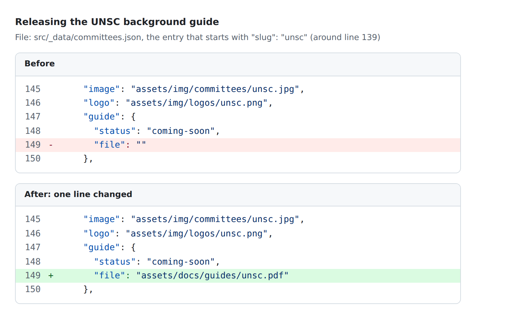
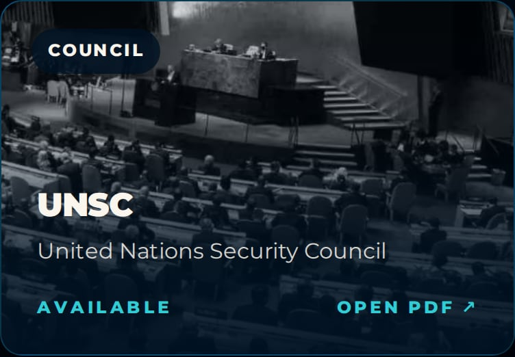
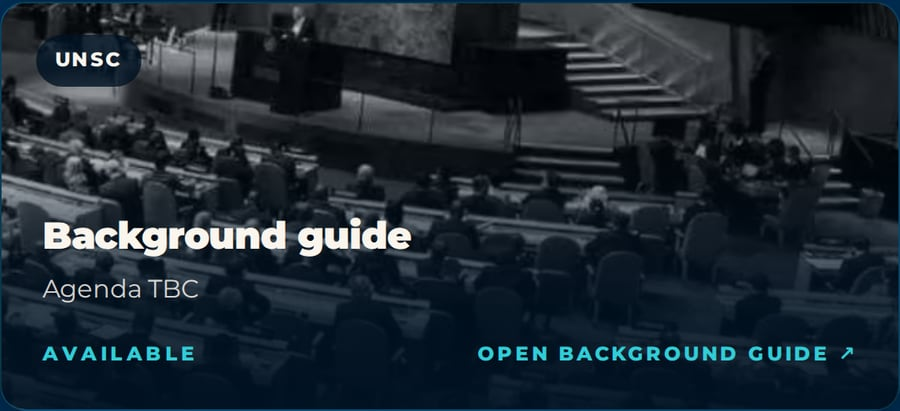

# Updating the website

You don't need to know how to code to update the site. Every name, date, agenda and link lives in a small set of text files, and you can edit them on GitHub's website from a computer or a phone. When you save, the site rebuilds and the change is live about two minutes later ([DEPLOY.md](DEPLOY.md) explains how).

If you make a mistake, the build stops before anything is uploaded, so the live site stays as it was, and the message tells you which file and line to fix.

## Where things live

All the content is in `src/_data/`:

| File | What's in it |
| --- | --- |
| `site.json` | The conference name, dates and venue; the announcement bar; the Register link; the contact email; homepage text; the theme; the Secretary-General's letter; sponsors; allocation rounds; the short intros on each page |
| `committees.json` | Every committee: code, full name, agenda, overview, photo, logo, background guide, and its executive board (EB) |
| `secretariat.json` | The Secretariat: names, roles, which row each person sits in, profile lines, photos, Instagram handles |
| `schedule.json` | Both days of the conference |
| `faq.json` | The questions and answers on the homepage |
| `resources.json` | Procedure documents, the International Press style guides and research links |
| `socialNight.json` | The Social Night page |
| `newToMun.json` | The New to MUN? page |

Photos and PDFs live in `src/assets/`:

| Folder | What goes in it |
| --- | --- |
| `src/assets/docs/guides/` | Background guide PDFs |
| `src/assets/docs/` | Other PDFs (Rules of Procedure, Delegation Guidelines and so on) |
| `src/assets/img/committees/` | One photo per committee. Colour is fine; it's made black and white automatically. |
| `src/assets/img/logos/` | Committee logo circles (PNG) |
| `src/assets/img/eb/` | Chair, Vice Chair and Rapporteur photos |
| `src/assets/img/secretariat/` | Secretariat photos and the Secretary-General's signature |
| `src/assets/img/sponsors/` | Sponsor logos (PNG or JPG) |

Name files in lower case with hyphens and no spaces, for example `unsc-chair.jpg`. In the data files, a path starts at `assets/`, without `src/`. For example, the file `src/assets/img/eb/unsc-chair.jpg` is written as `"assets/img/eb/unsc-chair.jpg"`.

## How to edit a file on GitHub

1. Go to github.com/suprathedude/jmun-26-wesbite and sign in.
2. Click `src`, then `_data`, then the file you want.
3. Click the pencil icon ("Edit this file"). On a phone, it's at the top right of the file. If you don't see it, tap the `...` menu and choose **Edit file**.
4. Make your change.
5. Click **Commit changes...**, write a short note such as "Release UNSC guide", leave **Commit directly to the main branch** selected, and click **Commit changes**.
6. Open the **Actions** tab. A yellow dot means it's building. A green tick about two minutes later means it's live.

**To upload a photo or PDF:** open the folder, click **Add file → Upload files**, choose the file, then **Commit changes**.

### Rules for the data files

The files are JSON. It looks fussy, but there are only a few rules:

- Text goes in straight double quotes: `"name": "Aryan Nadimpalli"`. Don't use a double quote inside the text; an apostrophe (`'`) is fine.
- Items are separated by commas. The last item before a `}` or `]` has no comma after it.
- Only change what's to the right of the colon. The names on the left (`"name"`, `"photo"`) must stay exactly as they are.
- `""` means "not set yet". Something that will exist but isn't decided yet says `TBC`, so it can be found later by searching for TBC.
- Write in British English, keep sentences short, and don't use long dashes (—).

### If the build fails

Open the red run in the Actions tab and click the step with the red cross. The message names the file and the problem. The common ones:

| Message | What it means |
| --- | --- |
| `src/_data/site.json has a typo near line 26, column 5: Expected ',' or '}' after property value.` | A comma is missing at the end of the line before line 26, or there's an extra one before a `}`. The message shows the line. |
| `committees.json, committee 4 (UNHRC), EB member 1: there's no photo at src/assets/img/eb/unhrc-chair.jpg.` | The path in the file doesn't match an uploaded file. Check the spelling and the folder, or upload the file. |
| `secretariat.json, person 3 (Raaghav Modukuri): "row" must be a whole number like 3, with no quote marks.` | Write `"row": 2`, not `"row": "2"`. |
| `schedule.json, day 1, event 3 (Break): type "breaks" must be one of "committee", "ceremony", "social", "meal", "break", "end".` | Same: use a listed value. |
| `resources.json, researchLinks 2 (UN Research Guides): the url must start with https://` | Links to other websites need the full address. |

Fix the file and commit again. Nothing went live while it was broken.

---

## Worked example: releasing a background guide

This releases the UNSC guide. Every other committee works the same way.

**1. Upload the PDF.** Open `src/assets/docs/guides/`, click **Add file → Upload files**, and upload the guide named after the committee's `slug`: `unsc.pdf`.

**2. Point the committee at it.** Open `src/_data/committees.json` and find the entry that starts with `"slug": "unsc"`. In its `"guide"` part, change `"file": ""` to the PDF's path. That's the only line that changes; `"status"` can stay as it is.



**3. Commit, then wait for the green tick.** Both the Resources page and the UNSC page switch from "Coming soon" to "Available", with a link that opens the PDF in a new tab.

Before, on Resources:


After, on Resources:



After, on the UNSC committee page:



The **essential documents** (Rules of Procedure, Delegation Guidelines, Consent Form) and the two **International Press style guides** (IP Journalism, IP Photography) work the same way. Upload the PDF to `src/assets/docs/`, then set its `"file"` in `src/_data/resources.json` (the style guides are under `"ipGuides"`), for example `"file": "assets/docs/rules-of-procedure.pdf"`. The card changes from "Coming soon" to "PDF".

---

## Add an EB member

Open `committees.json` and find the committee. Its `"eb"` list has three people: Chair, Vice Chair and Rapporteur. Fill in their details:

```json
{
  "role": "Chair",
  "name": "Ananya R.",
  "photo": "assets/img/eb/unsc-chair.jpg",
  "bio": "Two or three sentences about them, written for 11-year-olds."
}
```

- Upload the photo to `src/assets/img/eb/` first. It's shown square, so put the face near the middle. Leave `"photo": ""` and the card shows "Photo TBC".
- While `"name"` is `""`, the card reads "EB announced soon".
- Long bios are cut to two lines with a "Read more" button.
- To add a fourth person, copy a whole `{ ... }` block, paste it after the last one, and put a comma between the two blocks.

## Change the announcement bar

In `site.json`:

```json
"announcement": {
  "enabled": true,
  "text": "Allocations for Round 1 are out",
  "link": "/allocations/"
},
```

- `"text"`: keep it short; it's shown in capitals across the top of every page.
- `"link"`: optional. Use a page of this site (`/allocations/`) or a full address (`https://...`). Leave it `""` for no link.
- `"enabled": false` hides the bar.
- Visitors who closed the bar see it again as soon as the text changes.

## Edit the schedule

In `schedule.json`, each day has a list of `"events"`. Each event looks like this:

```json
{
  "start": "9:30 am",
  "end": "11:00 am",
  "title": "Committee session 1",
  "type": "committee"
}
```

- `"start"` and `"end"`: write times like `8:00 am` or `1:30 pm`. The length shown under the title ("1 hour 30 minutes") is worked out for you. For the last event of a day, leave `"end": ""` and it reads "7:00 pm onwards".
- `"type"` is one of `committee`, `ceremony`, `social`, `meal`, `break` or `end`. It isn't shown, but the `committee` events are counted for the line under the schedule title.
- Optional: `"link"`, a page the event's title links to, for example `"/social-night/"`.
- To change the order, move whole `{ ... }` blocks. Mind the commas.
- Each day has a `"label"` (`"Day one"`, shown in capitals) and a `"dateLabel"` (`"Friday 30 October"`).
- `"note"` at the top shows next to the schedule title (under it on phones). Update it when the times are final, or set it to `""` to hide it. The line above it ("Two days, nine committee sessions.") counts the days and the `committee` events by itself.

## Edit the Secretariat

Each person in `secretariat.json` looks like this:

```json
{
  "name": "Aryan Nadimpalli",
  "role": "Deputy Secretary-General",
  "group": "leadership",
  "row": 2,
  "blurb": "",
  "photo": "",
  "signature": "",
  "instagram": ""
}
```

- `"row"`: people with the same number sit side by side, and rows go in number order. Write the number without quote marks. Up to three to a row looks best. On phones, a row shows two people to a line.
- `"group"`: `leadership` for the top six, `usg` for the Under-Secretaries-General. A row can't mix the two.
- `"blurb"`: one short line under the name, for example their grade and what they're looking forward to. While it's `""`, the card reads "Profile TBC.".
- `"photo"`: upload it to `src/assets/img/secretariat/` first. It's shown tall (4:5), so keep the face in the top half. While it's `""`, the card shows initials.
- `"instagram"`: the handle, with or without `@`. It appears as a button on the back of the card.
- To add someone, copy a whole `{ ... }` block, paste it where they should appear, and mind the commas.

## Turn the theme on

In `site.json`:

```json
"theme": {
  "enabled": true,
  "words": ["Word", "Word", "Word"],
  "highlight": 2,
  "caption": "One sentence about the theme."
},
```

- `"words"`: the theme, a few words long.
- `"highlight"`: which word is shown in teal, counting from 1.
- While `"enabled"` is `false`, the homepage shows "Conference theme announced soon" instead.

## Add a sponsor

1. Upload the logo to `src/assets/img/sponsors/`, as a PNG or JPG at least 400 pixels wide (for example `acme.png`).
2. In `site.json`, add the sponsor to `"sponsors"` (the list is empty, `[]`, until the first one):

```json
"sponsors": [
  { "name": "Acme Ltd", "logo": "assets/img/sponsors/acme.png", "url": "https://acme.example" }
],
```

For a second sponsor, add a comma after the first `}` and another `{ ... }`. The "Our sponsors" strip appears at the bottom of the homepage as soon as there's one. `"url"` is optional; use `""` for none.

## Add or remove a committee

**To add one,** copy a whole committee block in `committees.json` (from its `{` to its `}`), paste it where it should appear in the list, and put a comma between it and its neighbours. Then change:

| Field | What to put |
| --- | --- |
| `"slug"` | Lower case letters, numbers and hyphens. It becomes the address: `"un-women"` → `/committees/un-women/`. It must not match another committee. |
| `"code"` | The short name, shown huge: `"UN Women"` |
| `"name"` | The full name |
| `"agenda"` | `"Agenda TBC"` until it's announced |
| `"overview"` | Two or three plain sentences |
| `"image"` | `"assets/img/committees/un-women.jpg"` after uploading the photo, or `""` for "Photo TBC" |
| `"logo"` | `"assets/img/logos/un-women.png"` after uploading the logo circle, or `""` for a globe icon |
| `"guide"` | `{ "status": "coming-soon", "file": "" }` |
| `"eb"` | The three EB entries, with `"name": ""` until they're announced |

Everything else updates by itself:
- the tile on the Committees page;
- the committee's own page;
- its guide card on Resources;
- the committee names scrolling across the homepage and the committee wheel;
- every committee count ("Twelve committees" becomes "Thirteen").

**To remove one,** delete its whole block from `{` to `}`, and the comma that went with it. You can delete its photo and logo too, but you don't have to.

---

## Other things you might change

| To change | Where |
| --- | --- |
| The Register button's link | `site.json` → `nav` → `register` → `url` |
| The "Consent form" button (hidden until it has a link) | `site.json` → `nav` → `secondary` → `url` |
| The contact email | `site.json` → `contact` → `email`, and the last answer in `faq.json` (with its button's `mailto:` link) |
| The conference dates | `site.json` → `start` and `end`, written like `2026-10-30T08:00:00+05:30`. The countdown and every date on the site follow these. |
| The Secretary-General's letter | `site.json` → `sgLetter`: `paragraphs` (one item per paragraph), `photo`, `signature` |
| Allocation rounds and the matrix link | `site.json` → `allocations`: `rounds` (`name`, `date`, `note`), `status`, `matrixUrl` |
| FAQ answers | `faq.json`. An answer can have a button: `"link": { "label": "See allocations", "url": "/allocations/" }` |
| Social Night details | `socialNight.json`: `time`, `dressCode`, `expect`, `faq`. The photo booth section appears once `photoBooth` has a sentence in it; add `photoBoothImage` for its photo. |
| Research links | `resources.json` → `researchLinks`: `title`, `url` (must start with `https://`), `description` |
| The hero photo or video | See [REPLACE_ME.md](REPLACE_ME.md), "Hero background" |

[REPLACE_ME.md](REPLACE_ME.md) lists every TBC on the site and what should replace it.
